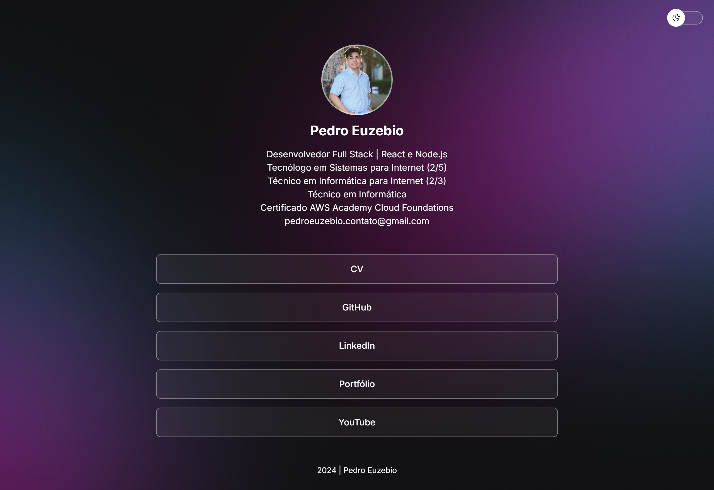

<h1 align="center">
  DevLinks
</h1>

## Roteiro

<ul>
  <li>
    <a href="#sobre">
      Sobre
    </a>
  </li>
  <li>
    <a href="#tecnologias">
      Tecnologias
    </a>
  </li>
  <li>
    <a href="#pre-requisitos">
      Pré-requisitos
    </a>
  </li>
  <li>
    <a href="#instalacao">
      Instalação
    </a>
  </li>
  <li>
    <a href="#executando">
      Executando
    </a>
  </li>
  <li>
    <a href="#deploy">
      Deploy
    </a>
  </li>
  <li>
    <a href="#autor">
      Autor
    </a>
  </li>
  <li>
    <a href="#Licença">
      Licença
    </a>
  </li>
</ul>



## Sobre

DevLinks é um agregador de links responsivo e com troca de tema que você pode usar como cartão de visitas nas suas redes sociais.

## Tecnologias

O projeto foi desenvolvido com as seguintes tecnologias:

- HTML
- CSS
- JavaScript

## Pré-requisitos

Verifique aos seguintes pré-requisitos para poder instalar e executar o projeto:

1. Ter instalado um editor de código: [VS Code](https://code.visualstudio.com/download)
2. Ter instalado o [Git](https://git-scm.com/downloads)
3. Ter instalado a extensão [Live Server](https://marketplace.visualstudio.com/items?itemName=ritwickdey.LiveServer)

## Instalação

Siga o passo a passo para instalar o projeto:

1. Abra o terminal e clone o repositório do projeto:

```bash
git clone https://github.com/pedroeuzebiooo/devlinks
```

## Executando

Siga o passo a passo para executar o projeto:

1. Entre na pasta do projeto clonado:

```bash
cd devlinks
```

2. Abra a pasta do projeto clonado no editor de código de sua preferência. Caso seja o VS Code digite o comando:

```bash
code .
```

3. Abra o arquivo `index.html` com a extensão Live Server do VS Code

## Deploy

- [Exibir projeto](/https://pedroeuzebiooo.github.io/devlinks)

## Autor

<table>
  <tr>
    <td align="center">
      
      <br>
      Pedro Euzebio
    </td>
  </tr>
</table>

## Licença

O projeto está sob licença MIT. Veja o arquivo [LICENSE](./LICENSE) para mais detalhes.
